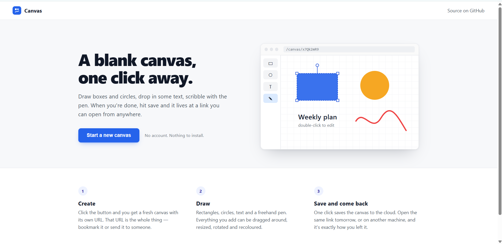
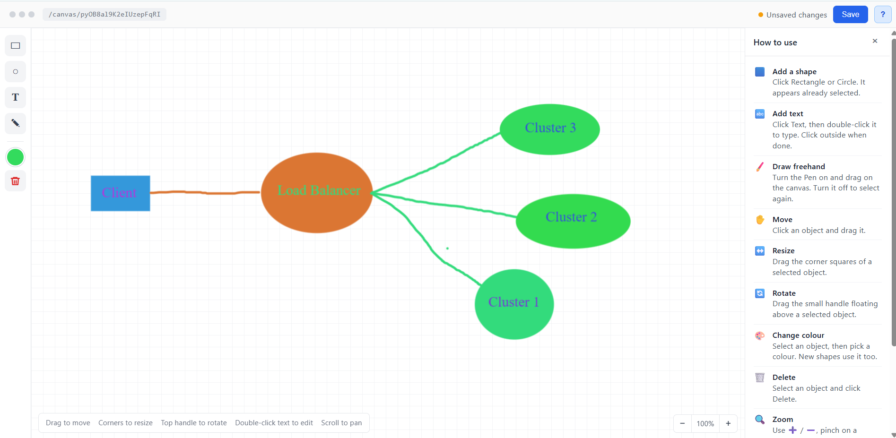

# Canvas — a small 2D editor

A browser-based canvas where you can drop in shapes and text, draw with a pen, and save the whole thing to a link. Open that link later (or on another machine) and carry on where you left off. No login, nothing to install.

**Live demo:** https://
2-d-canvas.vercel.app




---

## What it does

- Click **Start a new canvas** on the home page. A Firestore document is created and you land on `/canvas/<id>`.
- On the canvas you can add **rectangles, circles and text**, and draw freehand with the **pen**.
- Anything on the canvas can be **moved, resized, rotated, recoloured and deleted**.
- **Scroll** to move around, **pinch / Ctrl + scroll** or the `− / +` buttons to zoom, so nothing is ever lost off-screen.
- Hit **Save** and the canvas goes to Firestore. Reopening the same URL loads it back.
- A **How to use** panel opens on the right the first time you land in the editor. Close it with `×`, bring it back with `?`.

---

## Tech stack

| | |
|---|---|
| UI | React 19 + Vite |
| Canvas | Fabric.js 7 |
| Storage | Firebase Firestore (no auth) |
| Routing | React Router 7 |
| Hosting | Vercel |

Plain CSS, no component library. The whole thing is about six source files.

---

## Running it locally

**1. Clone and install**

```bash
git clone https://github.com/YOUR-USERNAME/YOUR-REPO.git
cd YOUR-REPO
npm install
```

**2. Set up Firebase**

- Go to [console.firebase.google.com](https://console.firebase.google.com) and create a project.
- Add a **Web app** to it and copy the config object it gives you.
- In the left menu open **Firestore Database → Create database**. Start in *test mode* so reads/writes work without auth.
- Paste your config into `src/firebase.js`:

```js
const firebaseConfig = {
  apiKey: "...",
  authDomain: "...",
  projectId: "...",
  storageBucket: "...",
  messagingSenderId: "...",
  appId: "..."
};
```

> Test-mode rules expire after 30 days. If saves suddenly start failing, that's usually why — open **Firestore → Rules** and extend the date or set `allow read, write: if true;` for the `canvases` collection.

**3. Start the dev server**

```bash
npm run dev
```

Open http://localhost:5173 and click the button.

---

## Deploying to Vercel

1. Push the repo to GitHub.
2. On [vercel.com](https://vercel.com) click **Add New → Project** and import the repo. Vercel detects Vite on its own — build command `vite build`, output `dist`.
3. Deploy.

`vercel.json` in the repo rewrites every path to `index.html`, which is what lets a deep link like `/canvas/abc123` work when someone opens it directly instead of hitting a 404.

---

## How the data is stored

One Firestore collection, `canvases`. One document per canvas:

```
canvases/<canvasId>
  canvasId:   "py0B8a19K2eIUzepFqRI"
  updatedAt:  "2026-09-10T10:15:56.000Z"
  fabricData: "{\"version\":\"7.4.0\",\"objects\":[ ... ]}"
```

`fabricData` is the output of Fabric's `canvas.toJSON()`, stored as a **string** rather than a nested object. Two reasons:

- Fabric's text objects carry a `path: undefined` field, and Firestore refuses any write containing `undefined`.
- Pen strokes are stored as an array of arrays (`[["M", x, y], ["Q", ...]]`), and Firestore doesn't allow nested arrays.

`JSON.stringify` sidesteps both, and Firestore's 1 MB document limit is plenty for a canvas like this.

---

## Project layout

```
src/
  components/
    LandingPage.jsx    home page + "create canvas"
    CanvasEditor.jsx   the editor: Fabric setup, load, save, toolbar
    HelpPanel.jsx      the "How to use" side panel
  utils/
    fabricHelpers.js   add rectangle / circle / text, pen toggle, delete
    viewportHelpers.js zoom buttons + scroll / pinch handling
  styles/
    LandingPage.css
    CanvasEditor.css
  firebase.js          Firebase init
```

---

## Small things that were worth getting right

- **Saving while typing.** If you click Save with the text cursor still blinking inside a text box, the edit is committed first so what you typed is what gets saved.
- **Opening a link that doesn't exist.** `/canvas/nonsense` doesn't show an empty editor — it sends you back to the home page.
- **Stale loads.** Objects that arrive from Firestore on page load don't flip the status to "Unsaved changes"; only things you actually do count.
- **Colour picker.** Picking a colour recolours the selected object *and* becomes the default for the next shape, so you don't have to set it twice.
- **Pen vs. selection.** Turning the pen on switches Fabric into drawing mode; turning it off returns to normal select/move. The button shows which mode you're in.
- **Zoom and pan aren't saved.** They're part of the view, not the drawing, so two people opening the same link both start at 100%.
- **Old saves with a white background.** Early on the canvas had a solid white background baked into the JSON. That's stripped on load now so the grid shows on every canvas, old or new.
- **Resizing the window.** The canvas re-measures itself when the window or the help panel changes size, so there's never dead space.

---

## Things I'd add next

- A warning before leaving the page with unsaved changes.
- Undo / redo.
- A straight-line / connector tool (drag from one shape to another).
- Keyboard shortcuts — `Delete` for delete, `V` / `P` to switch tools.
- Export to PNG.
